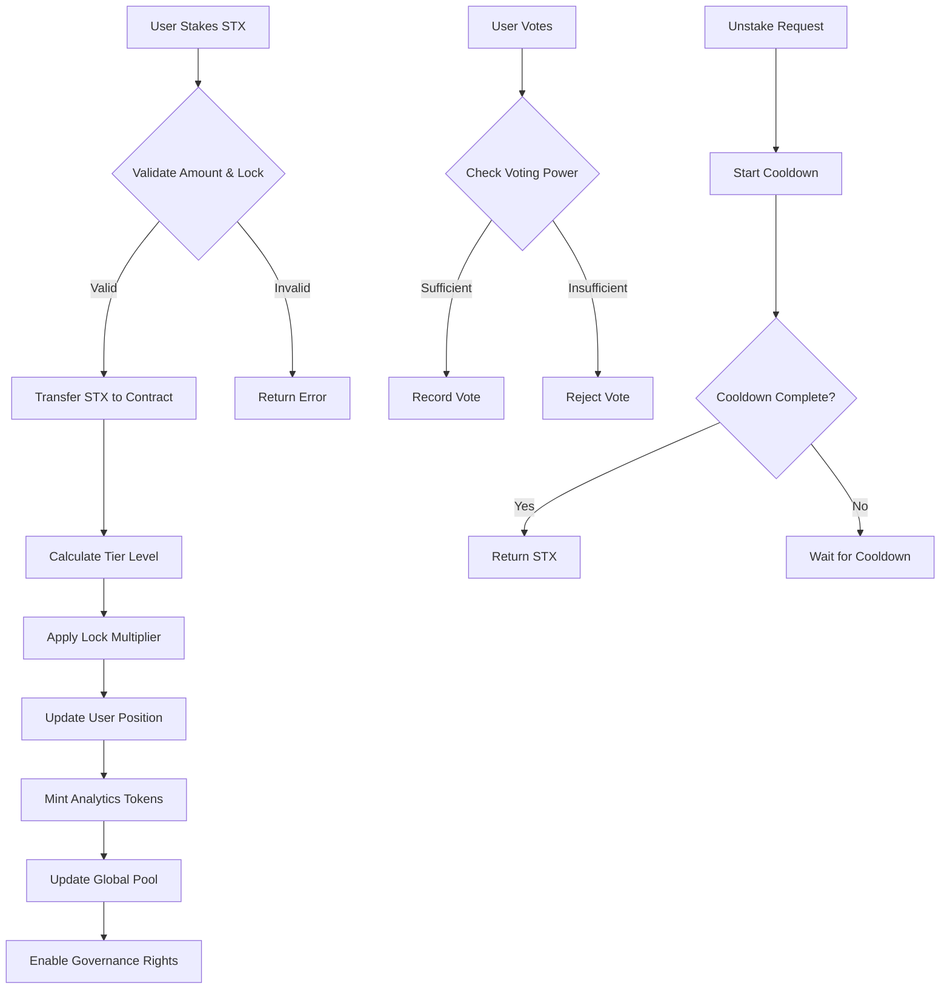

# BitStack Analytics Protocol

A comprehensive DeFi staking and governance platform built for the Stacks ecosystem with Bitcoin-backed security. This protocol enables users to stake STX tokens with tiered rewards, participate in decentralized governance, and earn ANALYTICS tokens through a sophisticated multi-tier system designed for long-term value creation and community-driven decision making on Bitcoin L2.

## Table of Contents

- [Overview](#overview)
- [Features](#features)
- [Architecture](#architecture)
- [Tier System](#tier-system)
- [Governance](#governance)
- [Getting Started](#getting-started)
- [API Reference](#api-reference)
- [Security](#security)
- [Contributing](#contributing)

## Overview

BitStack Analytics Protocol is a next-generation DeFi platform that combines:

- **Tiered Staking System**: Three-tier reward structure (Silver, Gold, Diamond) with escalating benefits
- **Time-Lock Bonuses**: Enhanced rewards for longer commitment periods
- **Decentralized Governance**: Community-driven decision making through proposal voting
- **Security First**: Built-in cooldown periods and emergency controls
- **Bitcoin L2 Integration**: Leverages Stacks blockchain for Bitcoin-secured DeFi

## Features

### Core Functionality

- ✅ STX token staking with flexible terms
- ✅ Multi-tier reward system with up to 2x multipliers
- ✅ Time-lock options for bonus rewards (1-2 months)
- ✅ Governance proposal creation and voting
- ✅ Emergency pause/resume controls
- ✅ Secure unstaking with cooldown periods

### Advanced Features

- 🔒 Health factor monitoring for risk management
- 📊 Real-time tier level calculations
- 🗳️ Weighted voting based on stake amount
- 🏆 Progressive reward multipliers
- 🛡️ Built-in security mechanisms

## Architecture

### System Overview

```
┌─────────────────┐    ┌─────────────────┐    ┌─────────────────┐
│   User Wallet   │    │  Smart Contract │    │   STX Pool      │
│                 │◄───┤   BitStack      ├───►│                 │
│  - STX Tokens   │    │   Analytics     │    │ - Staked STX    │
│  - Voting Power │    │   Protocol      │    │ - Rewards Pool  │
└─────────────────┘    └─────────────────┘    └─────────────────┘
         │                       │                       │
         ▼                       ▼                       ▼
┌─────────────────┐    ┌─────────────────┐    ┌─────────────────┐
│   Governance    │    │   Tier System   │    │   Analytics     │
│                 │    │                 │    │   Token Mint    │
│ - Proposals     │    │ - Silver Tier   │    │                 │
│ - Voting        │    │ - Gold Tier     │    │ - Reward Dist.  │
│ - Execution     │    │ - Diamond Tier  │    │ - Token Supply  │
└─────────────────┘    └─────────────────┘    └─────────────────┘
```

### Contract Architecture

The protocol is structured around several key components:

#### Core Data Structures

1. **UserPositions**: Comprehensive user state tracking
   - Total collateral and debt positions
   - STX staked amounts and Analytics token balance
   - Tier level and reward multipliers
   - Voting power calculations

2. **StakingPositions**: Detailed staking information
   - Stake amounts and timing
   - Lock periods and cooldown states
   - Accumulated rewards tracking

3. **Governance System**: Decentralized decision making
   - Proposal creation and management
   - Voting mechanisms with weighted power
   - Execution controls and validation

#### Key Functions

**Staking Operations**

- `stake-stx`: Deposit STX with optional time-lock
- `initiate-unstake`: Begin withdrawal process
- `complete-unstake`: Finalize withdrawal after cooldown

**Governance Operations**

- `create-proposal`: Submit governance proposals
- `vote-on-proposal`: Cast weighted votes
- Automatic tier-based voting power calculation

**Administrative Controls**

- `pause-contract` / `resume-contract`: Emergency controls
- `initialize-contract`: Setup tier configurations

### Data Flow



## Tier System

The protocol implements a three-tier system with progressive benefits:

| Tier | Minimum Stake | Reward Multiplier | Features |
|------|---------------|------------------|----------|
| **Silver** | 1 STX | 1.0x | Basic staking, governance voting |
| **Gold** | 5 STX | 1.5x | Enhanced rewards, priority features |
| **Diamond** | 10 STX | 2.0x | Maximum rewards, exclusive features |

### Time-Lock Bonuses

Additional multipliers based on commitment period:

- **No Lock**: 1.0x base multiplier
- **1 Month Lock**: 1.25x multiplier
- **2 Month Lock**: 1.5x multiplier

*Combined tier and time-lock multipliers are applied multiplicatively.*

## Governance

### Proposal Creation

Users with minimum 1 STX voting power can create proposals:

```clarity
(create-proposal "Proposal description" u1440) ;; 24-hour voting period
```

### Voting Mechanism

- **Voting Power**: Based on staked STX amount
- **Weighted Votes**: Larger stakes have proportionally more influence
- **Time Limits**: Configurable voting periods (17 hours - 20 days)
- **Minimum Participation**: 1 STX minimum votes required for execution

### Proposal Lifecycle

1. **Creation**: User submits proposal with description
2. **Voting Period**: Community votes for/against
3. **Validation**: Check minimum participation requirements
4. **Execution**: Implement approved proposals (manual/automatic)

## Getting Started

### Prerequisites

- Stacks wallet with STX tokens
- Connection to Stacks blockchain
- Understanding of DeFi staking concepts

### Basic Usage

1. **Initialize Staking**

   ```clarity
   ;; Stake 5 STX with 1-month lock for Gold tier benefits
   (stake-stx u5000000 u4320)
   ```

2. **Create Governance Proposal**

   ```clarity
   ;; Submit proposal for community voting
   (create-proposal "Increase reward rates by 1%" u2880)
   ```

3. **Vote on Proposals**

   ```clarity
   ;; Vote in favor of proposal #1
   (vote-on-proposal u1 true)
   ```

4. **Unstake Process**

   ```clarity
   ;; Step 1: Initiate unstaking
   (initiate-unstake u5000000)
   
   ;; Step 2: Wait 24 hours, then complete
   (complete-unstake)
   ```

## API Reference

### Public Functions

#### Staking Functions

- `stake-stx(amount, lock-period)` - Stake STX tokens
- `initiate-unstake(amount)` - Begin unstaking process
- `complete-unstake()` - Complete unstaking after cooldown

#### Governance Functions

- `create-proposal(description, voting-period)` - Create governance proposal
- `vote-on-proposal(proposal-id, vote-for)` - Cast vote on proposal

#### Administrative Functions

- `pause-contract()` - Emergency pause (owner only)
- `resume-contract()` - Resume operations (owner only)

### Read-Only Functions

- `get-user-position(user)` - Get complete user information
- `get-staking-position(user)` - Get staking details
- `get-proposal(proposal-id)` - Get proposal information
- `get-stx-pool()` - Get total staked STX
- `get-reward-rates()` - Get current reward configuration

## Security

### Built-in Security Features

- **Cooldown Periods**: 24-hour unstaking delay prevents rapid exit
- **Emergency Pause**: Owner can halt operations during security incidents
- **Input Validation**: Comprehensive checks on all user inputs
- **Access Controls**: Role-based permissions for administrative functions

### Risk Considerations

- **Smart Contract Risk**: Audit code thoroughly before mainnet deployment
- **Governance Risk**: Large stakeholders have proportional voting power
- **Liquidity Risk**: Time-locked stakes cannot be withdrawn immediately
- **Market Risk**: STX price volatility affects staked value

### Recommended Practices

- Start with small stakes to understand the system
- Participate in governance to influence protocol direction
- Monitor health factors and tier benefits regularly
- Keep private keys secure and use hardware wallets

## Contributing

We welcome contributions to improve the BitStack Analytics Protocol:

1. **Code Contributions**: Submit pull requests with improvements
2. **Bug Reports**: Report issues through GitHub issues
3. **Feature Requests**: Propose new features for community discussion
4. **Documentation**: Help improve documentation and guides

### Development Setup

1. Clone the repository
2. Install Clarinet for local development
3. Run tests: `clarinet test`
4. Deploy locally: `clarinet deploy`

---

**Built with ❤️ for the Stacks ecosystem and Bitcoin L2 innovation.**
